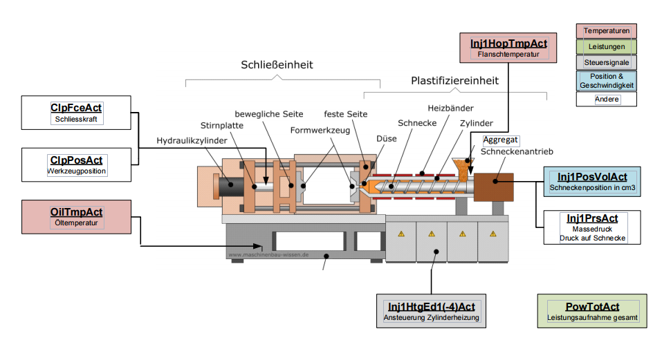

# ML-Assignment

## Introduction
The goal of this assignment is to apply your knowledge about linear regression to a real-world problem. Your
task for the next two weeks will be to analyze the given data using the techniques we have learned up to
now.


*Figure 0: Machine Learning explained by xkcd.com*

Injection molding (Spritzgiessen) is a highly complex process. Environmental conditions, varying characteristics of the input materials, and internal machine parameters and conditions have a direct impact on the
produced components. Often the machine operator has to tune machine settings for each new part in order
to achieve an optimal performance and quality. The institutes ICOM and IWK are currently working on a
joint project with the goal to develop an automated quality assurance system for injection molding machines.
For a set of produced parts, internal machine measurements and parameters, as well as the resulting mass of
the part, have been logged. Your task will be to estimate the mass of a part, given the machine measurements.
With that, the optimal amount of raw material for new parts can be found. The produced part is an ice
scraper, as shown in Figure 1.

*Figure 1: Ice scraper*

The injection molding machine with its components is shown in figure 2

*Figure 2: Injection molding machine*

## Description of Dataset
The dataset consists of two CSV files: InjectionMoldingData_Train.csv, which contains all training samples, and InjectionMoldingData_Test.csv, which contains all test samples. Both files contain 9 columns:
8 predictors and the response. There are 150 training samples and 82 test samples available. All variables are
described in Table 1. A drawing of a typical injection molding machine and the labels of each measurement
is shown in Figure 2.

Name | Description
---- | -----------
PowTotAct_Min | Total power consumption of the machine
Inj1PosVolAct_Var | Position of the screw
Inj1PrsAct_meanOfInjPhase | Melt pressure on screw
Inj1HopTmpAct_1stPCscore | Temperature of the flange
Inj1HtgEd3Act_1stPCscore | Cylinder heating
ClpFceAct_1stPCscore | Clamping force
ClpPosAct_1stPCscore | Clamp position
OilTmp1Act_1stPCscore | Oil temperature
mass | Mass of the produced part

*Table 1: Description of predictors and response of the injection molding dataset.*


## Questions
1. Analyze the training data. Is there a variable which is highly correlated to another variable? List all
variables with correlation coefficients ≥ 0.9.
2. Assume you can only choose one feature to predict the mass as well as possible. Which variable do you
select? Explain why you select this variable and show the relevant numbers (p-value and R2
-value).
3. Build a linear regression model which uses as many input variables as required. Keep in mind that
each sensor costs money, so remove variables which are not needed from the model. List the selected
variables and the relevant numbers for selecting them (p-value and R2
-value).
4. Use the selected model to predict the mass on the test data. Compare the training MSE to the test
MSE. How does your model perform on the test data?
5. Add higher-order terms, such as quadratic terms or interaction terms to improve the model. Judge the
model quality (R2 values). Again, compare the training MSE to the test MSE.

# Report
## Setup
First, we prepare the program to read in the training data and the test data. I used panda for this
and i also imported numpy for later use

```
import numpy as np
import pandas as pd


def main():
    training_data_input = "../data/InjectionMolding_Train.csv"
    test_data_input = "../data/InjectionMolding_Test.csv"
    training_data = pd.read_csv(training_data_input, usecols=[0, 1, 2, 3, 4, 5, 6, 7, 8])


if __name__ == '__main__':
    main()
```

## 1. Correlation between variables
For the correlation between variables, i decided to use the pandas correlation function

```
def correlate_data(data):
    corr = data.corr()
    return corr


def plot_correlation_matrix(correlation_data):
    plt.figure(figsize=(8, 8))
    plt.imshow(correlation_data, interpolation='none', aspect='auto')
    plt.title('Correlation Matrix', fontsize=18)
    plt.colorbar()
    plt.show()


# Reduce the redundant pairs and the correlation from a predictor with itself
def get_redundant_pairs(data):
    pairs_to_drop = set()
    cols = data.columns
    for i in range(0, data.shape[1]):
        for j in range(0, i+1):
            pairs_to_drop.add((cols[i], cols[j]))
    return pairs_to_drop


# Get the top five correlations between predictors, redundancy excluded
def get_top_abs_correlations(data, n=5):
    au_corr = data.corr().abs().unstack()
    labels_to_drop = get_redundant_pairs(data)
    au_corr = au_corr.drop(labels=labels_to_drop).sort_values(ascending=False)
    return au_corr[0:n]
```

And in the main() function, add:

```
correlation_data = correlate_data(training_data)
print(get_top_abs_correlations(correlation_data))
plot_correlation_matrix(correlation_data)
```
The results are a listing of the top five correlations and a plot of the correlation matrix.
```
Inj1PosVolAct_Var          Inj1PrsAct_meanOfInjPhase    0.995215
                           mass                         0.964210
Inj1PrsAct_meanOfInjPhase  mass                         0.944900
                           Inj1HtgEd3Act_1stPCscore     0.910607
Inj1PosVolAct_Var          Inj1HtgEd3Act_1stPCscore     0.875376
dtype: float64 
```


*Figure 3: Plotted Correlation Matrix*

We have multiple pairs that correlate with more than 0.9: 
```
Inj1PosVolAct_Var          Inj1PrsAct_meanOfInjPhase    0.995215
                           mass                         0.964210
Inj1PrsAct_meanOfInjPhase  mass                         0.944900
                           Inj1HtgEd3Act_1stPCscore     0.910607
```

The Position of the screw (Inj1PosVolAct_Var) correlates with
Melt pressure on screw (Inj1PrsAct_meanOfInjPhase) and mass

The Melt pressure on screw (Inj1PrsAct_meanOfInjPhase) also correlates with the mass  
and with the cylinder heating (Inj1HtgEd3Act_1stPCscore)

## 2. Which predictor to choose?
For this part of the assignment, i used the statsmodels.formula.api module to directly print a result set with
all relevant information. the code looks as follows:
```
def statsmodel_regression(training_data, formula: str):
    model = sm.ols(formula, training_data)
    result = model.fit()
    parameters = result.summary()
    return parameters
```
in the main() i add the following lines
```
formula = "mass ~ PowTotAct_Min " \
              "+ Inj1PosVolAct_Var" \
              "+ Inj1PrsAct_meanOfInjPhase" \
              "+ Inj1HopTmpAct_1stPCscore" \
              "+ Inj1HtgEd3Act_1stPCscore" \
              "+ ClpFceAct_1stPCscore" \
              "+ ClpPosAct_1stPCscore" \
              "+ OilTmp1Act_1stPCscore"
    parameters = statsmodel_regression(training_data, formula)
    print(parameters)
```
The resulting table shows a lot of data. 
```
                             OLS Regression Results                            
==============================================================================
Dep. Variable:                   mass   R-squared:                       0.987
Model:                            OLS   Adj. R-squared:                  0.986
Method:                 Least Squares   F-statistic:                     1312.
Date:                Wed, 23 Oct 2019   Prob (F-statistic):          2.55e-128
Time:                        13:51:36   Log-Likelihood:                 459.93
No. Observations:                 150   AIC:                            -901.9
Df Residuals:                     141   BIC:                            -874.8
Df Model:                           8                                         
Covariance Type:            nonrobust                                         
=============================================================================================
                                coef    std err          t      P>|t|      [0.025      0.975]
---------------------------------------------------------------------------------------------
Intercept                    30.3054      0.356     85.160      0.000      29.602      31.009
PowTotAct_Min              8.399e-07   1.06e-06      0.789      0.431   -1.26e-06    2.94e-06
Inj1PosVolAct_Var             0.0052      0.001      6.772      0.000       0.004       0.007
Inj1PrsAct_meanOfInjPhase     0.0044      0.001      7.827      0.000       0.003       0.006
Inj1HopTmpAct_1stPCscore     -0.0001      0.000     -0.309      0.758      -0.001       0.001
Inj1HtgEd3Act_1stPCscore      0.0005   4.74e-05     10.508      0.000       0.000       0.001
ClpFceAct_1stPCscore         -0.0004   4.19e-05     -9.012      0.000      -0.000      -0.000
ClpPosAct_1stPCscore         -0.0002      0.000     -1.162      0.247      -0.001       0.000
OilTmp1Act_1stPCscore         0.0014      0.000     10.888      0.000       0.001       0.002
==============================================================================
Omnibus:                       10.810   Durbin-Watson:                   2.054
Prob(Omnibus):                  0.004   Jarque-Bera (JB):               26.680
Skew:                          -0.044   Prob(JB):                     1.61e-06
Kurtosis:                       5.064   Cond. No.                     3.56e+05
==============================================================================
```
The R-Squared value shows, that the model explains a large portion of the variance in the response variable.
The P>|t| values show significance of the predictor for the model and in general a value lower than 0.005 is preferable.

This means, that the position of the screw (Inj1PosVolAct_Var), the melt pressure of the screw 
(Inj1PrsAct_meanOfInjPhase), the cilinder heating (Inj1HtgEd3Act_1stPCscore), 
the clamp force (ClpFceAct_1stPCscore) and the oil temperature (OilTmp1Act_1stPCscore) are all
viable predictors for the response. 

To be able to choose the predictor with the highest R squared combined with a p-value smaller than 0,005, i add the 
following lines of code to the main() function
```

    formula = "mass ~ Inj1PosVolAct_Var"
    parameters = statsmodel_regression(training_data, formula)
    print(parameters)

    formula = "mass ~ Inj1PrsAct_meanOfInjPhase"
    parameters = statsmodel_regression(training_data, formula)
    print(parameters)

    formula = "mass ~ Inj1HtgEd3Act_1stPCscore"
    parameters = statsmodel_regression(training_data, formula)
    print(parameters)

    formula = "mass ~ ClpFceAct_1stPCscore"
    parameters = statsmodel_regression(training_data, formula)
    print(parameters)

    formula = "mass ~ OilTmp1Act_1stPCscore"
    parameters = statsmodel_regression(training_data, formula)
    print(parameters)
```
This results in the following output:
```
Parameters of position of the screw
0.80049082498907 1.1506184460940665e-53

Parameters of melt pressure of the screw
0.8098511654735854 3.2668351291332025e-55

Parameters of Cylinder heating
0.37076447406316093 1.376962458127483e-16

Parameters of clamp force
0.6463766619331468 3.1716905153677333e-35

Parameters of the oil temperature
0.0021638722385983744 0.5718968468560208
```
The melt pressure on the screw (Inj1PrsAct_meanOfInjPhase) has a R-squared of 0.810 and has a high correlation
with the mass, so i choose this predictor. 

## 3. Model with only relevant predictors
For this model, i add the following lines of code. I went with with a forward selection process, meaning that in every
iteration i add a predictor with the lowes p-value and check, if the R-squared value gets better.
```
 print("Add posistion of the screw to melt pressure")
    formula = "mass ~ Inj1PrsAct_meanOfInjPhase" \
              "+ Inj1PosVolAct_Var"
    model = sm.ols(formula, training_data).fit()
    print("{} {}".format(model.rsquared, model.pvalues))
    print("")

    print("Add clamp force")
    formula = "mass ~ Inj1PrsAct_meanOfInjPhase" \
              "+ Inj1PosVolAct_Var" \
              "+ ClpFceAct_1stPCscore"
    model = sm.ols(formula, training_data).fit()
    print("{} {}".format(model.rsquared, model.pvalues))
    print("")

    print("Add oil cylinder heating")
    formula = "mass ~ Inj1PrsAct_meanOfInjPhase" \
              "+ Inj1PosVolAct_Var" \
              "+ ClpFceAct_1stPCscore" \
              "+ Inj1HtgEd3Act_1stPCscore"
    model = sm.ols(formula, training_data).fit()
    print("{} {}".format(model.rsquared, model.pvalues))
    print("")

    print("Add oil temperature")
    formula = "mass ~ Inj1PrsAct_meanOfInjPhase" \
              "+ Inj1PosVolAct_Var" \
              "+ ClpFceAct_1stPCscore" \
              "+ Inj1HtgEd3Act_1stPCscore" \
              "+ OilTmp1Act_1stPCscore"
    model = sm.ols(formula, training_data).fit()
    print("{} {}".format(model.rsquared, model.pvalues))
    print("")
```
This procedure results in:
```
Add posistion of the screw to melt pressure
0.8366357970346275 
Intercept                    2.138112e-58
Inj1PrsAct_meanOfInjPhase    6.251028e-08
Inj1PosVolAct_Var            2.401760e-06
dtype: float64

Add clamp force
0.9575214769385876 
Intercept                    1.155154e-100
Inj1PrsAct_meanOfInjPhase     1.317330e-22
Inj1PosVolAct_Var             1.088053e-03
ClpFceAct_1stPCscore          1.511120e-44
dtype: float64

Add oil cylinder heating
0.9739211118731628 
Intercept                    4.196558e-114
Inj1PrsAct_meanOfInjPhase     2.951911e-02
Inj1PosVolAct_Var             1.317246e-02
ClpFceAct_1stPCscore          4.077625e-49
Inj1HtgEd3Act_1stPCscore      4.584282e-17
dtype: float64

Add oil temperature
0.9865244378155531 
Intercept                    9.643363e-126
Inj1PrsAct_meanOfInjPhase     2.753278e-14
Inj1PosVolAct_Var             7.404307e-11
ClpFceAct_1stPCscore          4.420079e-16
Inj1HtgEd3Act_1stPCscore      1.831581e-20
OilTmp1Act_1stPCscore         2.144593e-22
dtype: float64
```
As one can see, the first number, which is the R-squared value for the model, increases with each addition of 
a predictor. Also, the p-value never crosses the 0.005 line which would show a bad iteration step.

## 4. Let the tests roll in 
Now its time to evaluate the chosen model with the test-data. Reminder:

Formula = "mass ~ Inj1PrsAct_meanOfInjPhase" \
              "+ Inj1PosVolAct_Var" \
              "+ ClpFceAct_1stPCscore" \
              "+ Inj1HtgEd3Act_1stPCscore" \
              "+ OilTmp1Act_1stPCscore"
              
The mean square error is calculated as shown in the following lines of code.
```
# Training data Mean Squared Errors
    model = sm.ols(formula, training_data).fit()
    predictions = model.predict(training_data)
    mean_squared_error = (np.mean(np.square(training_data.mass - predictions)))
    print("Training-MSE: " + str(mean_squared_error))

    # Test data mean squared errors
    model = sm.ols(formula, training_data).fit()
    predictions = model.predict(test_data_predictors)
    mean_squared_error = np.mean(np.square(test_data_response.mass - predictions))
    print("Test-MSE: " + str(mean_squared_error))
```
Resulting MSE's:
```
Training-MSE: 0.00012927825694237846
Test-MSE: 0.00017884062549372874
```
Both the training and test mse's are quite low which means that on average, he predicted mass deviates from 
 the actual mass by about 0.00018g. This is less than 0.001% deviation.
  
## 5. Higher order terms
Assumption: Melt pressure interacts with other predictors.

So i test the model with the following four formulas:

mass ~ I(Inj1PrsAct_meanOfInjPhase **2) + Inj1PosVolAct_Var

mass ~ I(Inj1PrsAct_meanOfInjPhase **2) + Inj1HtgEd3Act_1stPCscore

mass ~ I(Inj1PrsAct_meanOfInjPhase **2) + ClpFceAct_1stPCscore

mass ~ I(Inj1PrsAct_meanOfInjPhase **2) + OilTmp1Act_1stPCscore
Code:
```
formula = "mass ~ I(Inj1PrsAct_meanOfInjPhase ** 2) + Inj1PosVolAct_Var"
    model = sm.ols(formula, training_data).fit()
    print("{} \n{}".format(model.rsquared, model.pvalues))
    predictions = model.predict(test_data_predictors)
    mean_squared_error = np.mean(np.square(test_data_response.mass - predictions))
    print("Test-MSE: " + str(mean_squared_error))
    print("")

    formula = "mass ~ I(Inj1PrsAct_meanOfInjPhase ** 2) + Inj1HtgEd3Act_1stPCscore"
    model = sm.ols(formula, training_data).fit()
    print("{} \n{}".format(model.rsquared, model.pvalues))
    predictions = model.predict(test_data_predictors)
    mean_squared_error = np.mean(np.square(test_data_response.mass - predictions))
    print("Test-MSE: " + str(mean_squared_error))
    print("")

    formula = "mass ~ I(Inj1PrsAct_meanOfInjPhase ** 2) + ClpFceAct_1stPCscore"
    model = sm.ols(formula, training_data).fit()
    print("{} \n{}".format(model.rsquared, model.pvalues))
    predictions = model.predict(test_data_predictors)
    mean_squared_error = np.mean(np.square(test_data_response.mass - predictions))
    print("Test-MSE: " + str(mean_squared_error))
    print("")

    formula = "mass ~ I(Inj1PrsAct_meanOfInjPhase ** 2) + OilTmp1Act_1stPCscore"
    model = sm.ols(formula, training_data).fit()
    print("{} \n{}".format(model.rsquared, model.pvalues))
    predictions = model.predict(test_data_predictors)
    mean_squared_error = np.mean(np.square(test_data_response.mass - predictions))
    print("Test-MSE: " + str(mean_squared_error))
```
Result:
```
0.8499181662792705 
Intercept                            5.687933e-60
I(Inj1PrsAct_meanOfInjPhase ** 2)    1.059112e-10
Inj1PosVolAct_Var                    7.885262e-05
dtype: float64
Test-MSE: 0.0011954647603415022

0.8812749130613108 
Intercept                            2.333609e-269
I(Inj1PrsAct_meanOfInjPhase ** 2)     4.249840e-55
Inj1HtgEd3Act_1stPCscore              1.597053e-12
dtype: float64
Test-MSE: 0.000720889337867233

0.9554152188182675 
Intercept                            0.000000e+00
I(Inj1PrsAct_meanOfInjPhase ** 2)    5.544314e-68
ClpFceAct_1stPCscore                 5.536850e-44
dtype: float64
Test-MSE: 0.00032245937751217455

0.9620744028690842 
Intercept                             0.000000e+00
I(Inj1PrsAct_meanOfInjPhase ** 2)    2.795905e-106
OilTmp1Act_1stPCscore                 3.700602e-49
dtype: float64
Test-MSE: 0.000246656257047295
```
In all of the tested formulas, the R-squared is worse than the model shown and tested in section 3 and 4.
The only noteworthy formula is {mass ~ I(Inj1PrsAct_meanOfInjPhase **2) + OilTmp1Act_1stPCscore} for which the 
R-squared is 0.962 and the MSE is 0.000247 which is remotely as good as the chosen model but still not good enough
to be considered as the new model.